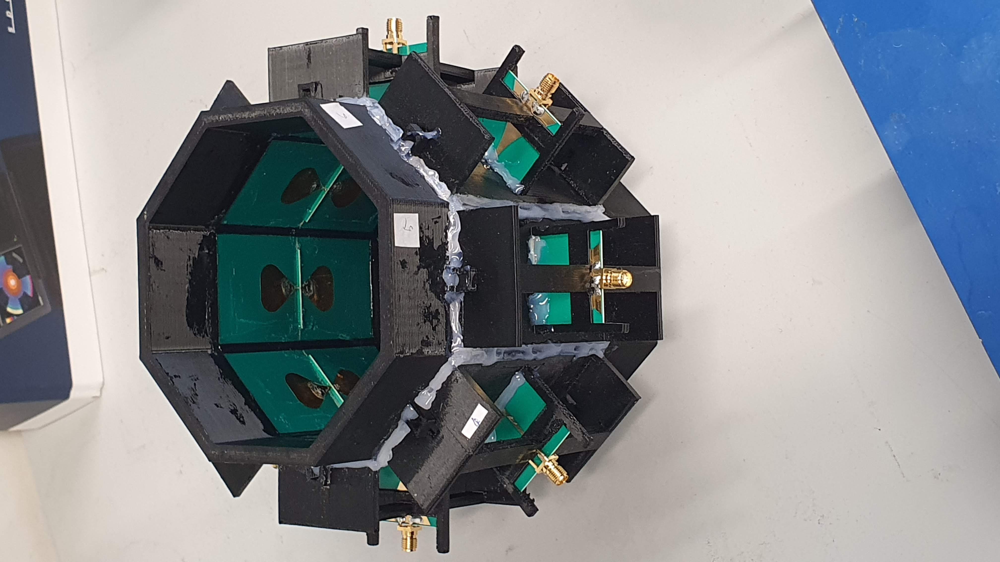
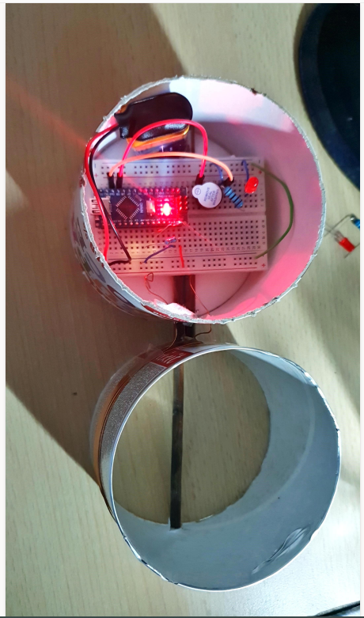

<h1 align="center">Hi, I'm Matej 👋</h1>
<h3 align="center">QA / R&D Test Engineer</h3>

Biomedical Engineer (M.Sc., CTU Prague) with hands-on R&D test engineering experience in MedTech.

---

### About me

I'm a biomedical engineer with 2+ years of R&D test engineering experience on cardiology diagnostic systems (ECG, ABPM, Holter), currently co-leading QA on two concurrent MedTech projects. I pair that with 8 years of client-facing operations experience, and I'm relocating to Canada on an IEC Working Holiday visa.

Outside of work, I build things — antennas, sensors, Arduino projects — and this profile collects the ones worth sharing.

### Featured projects

<table>
<tr>
<td width="50%" valign="top">
<a href="https://github.com/your-username/uwb-antenna-thermometry">
 
<b>UWB Antenna System for Microwave Thermometry</b>
</a>
  
Master's thesis project (graduated with honors): an 8-element UWB antenna array for non-invasive microwave thermometry during hyperthermia treatment. Sim4Life simulation → PCB/3D-print fabrication → VNA measurement → DAS image reconstruction.
  
<code>Sim4Life</code> <code>MATLAB</code> <code>PCB</code> <code>3D printing</code>
</td>
<td width="50%" valign="top">
<a href="https://github.com/your-username/metal-detector-arduino">
 
<b>Arduino Pulse-Induction Metal Detector</b>
</a>
  
A hand-built pulse-induction metal detector with a hand-wound search coil, driven by an Arduino Nano, with audible feedback via buzzer and LED.
  
<code>Arduino</code> <code>C++</code> <code>Electronics</code>
</td>
</tr>
<tr>
<td width="50%" valign="top">
<a href="https://github.com/your-username/multifunctional-personal-device">
<b>📟 Multifunctional Personal Device</b>
</a>
  
A multi-sensor Arduino device combining ultrasonic distance, temperature (DS18B20), and heart-rate (BPM) measurement, with live readout on an OLED display.
  
<code>Arduino</code> <code>OLED</code> <code>Sensors</code>
</td>
<td width="50%" valign="top">
<a href="https://github.com/your-username/arduino-laser-tag-system">
<b>🎯 Arduino Laser Tag System</b>
</a>
  
A two-part Arduino project: a hand-held blaster with multiple firing modes (standard / shotgun / sniper), and a photodiode-based hit detector.
  
<code>Arduino</code> <code>C++</code> <code>Game logic</code>
</td>
</tr>
</table>

### Skills

**QA & Test Engineering** — Manual software testing, test scenario design, defect tracking, HW/SW integration testing, functional validation of regulated MedTech systems

**Electrical Engineering** — Circuit diagnostics (oscilloscope, multimeter), microcontroller programming, PCB soldering, antenna design & EM simulation (Sim4Life)

**Programming & Data** — Python, MATLAB, R, C++ (Arduino)

**Task Management** — codeBeamer, YouTrack, Miro, Agile/sprint workflows

**Languages** — Czech (native), English (full working proficiency)

---

<i>Currently: R&D Test Engineer at BTL Medical & Healthcare Technologies, Prague </i>

